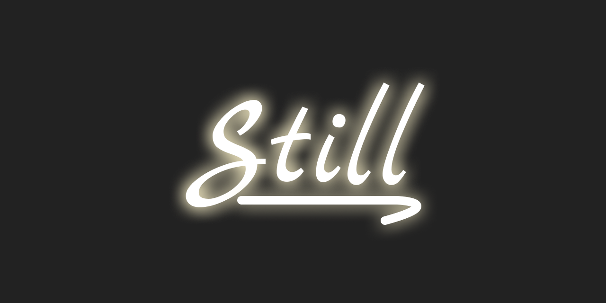

# Still: a composable Elixir static site generator



[![][build-badge]][build]
[![][hex-badge]][hex]
[![][docs-badge]][docs]

🚧 **This package is still in progress - _badumm tss_**

Still is a different take on building static sites.

Still takes a step back from the status quo, to a simpler time, without
compromising on the great developer experience some of us have grown used to.

Still is the web, still how you used to. Still weird. Still simple.

Still focuses on your happiness and speed of development. It automates the
boring parts and leaves the good ones to you.

Still shines the spotlight on your abilities to write the best code you can. It
is customisable, composable and as extensible as you want to. It is as powerful
as you are.

Still is our gift to the community. Stay simple. Stay weird.

For more information please read the [documentation][docs].

## Installation

To install Still you add it to your dependency list. You should be able to
add it to any mix project.

### For new projects

Run `mix archive.install hex still_new` to install the archive on your system.

Afterwards, create a static site by running `mix still.new my_site`.
That's it!

### Adding to an existing project

Add `still` as a dependency in `mix.exs`:

```elixir
def deps do
  [
    {:still, "~> 0.2.1"}
  ]
end
```

Open up `config.exs` and set the input and output folders:

```elixir
config :still,
  input: Path.join(Path.dirname(__DIR__), "priv/site"),
  output: Path.join(Path.dirname(__DIR__), "_site")
```

Create a file `index.slime` in the input folder.

For more information please visit the [website][website].

## About

Still was created and is maintained with :heart: by [Subvisual][subvisual].

![Subvisual][sub-logo]

## License

Still is released under the [ISC License](./LICENSE).

[website]: https://stillstatic.io
[subvisual]: https://subvisual.com
[docs]: https://hexdocs.pm/still/getting_started.html
[hex]: https://hex.pm/packages/still
[build]: https://github.com/still-ex/still/actions
[sub-logo]: https://raw.githubusercontent.com/subvisual/guides/master/github/templates/logos/blue.png
[hex-badge]: https://img.shields.io/hexpm/v/still?style=flat-square
[build-badge]: https://img.shields.io/github/workflow/status/still-ex/still/Elixir%20CI?style=flat-square
[docs-badge]: https://img.shields.io/badge/-docs-informational?style=flat-square
